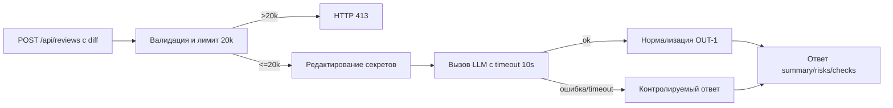

# Анализ процесса: AS IS и TO BE

Файл ведёт OpenCode. Обсудите с агентом содержание и проверьте предложенный diff. Все дополнения и исправления поручайте агенту в чате.

## AS IS

Пользователь отправляет HTTP POST на /api/reviews c JSON {"diff": "..."}. FastAPI синхронный обработчик напрямую вызывает ReviewService.review, который формирует строковый prompt и передаёт сырый diff во внешний LLM без редактирования секретов, без лимита размера и без таймаута. Ответ LLM возвращается как {"comment": str}. В показанном diff нет явного указания response_model, а возвращаемый результат {"comment": ...} не соответствует OUT-1. В показанном diff не видно реализации требований OBS-1. Возможные задержки: долгий ответ LLM, зависания без таймаута. Точки риска: секреты в prompt, превышение лимита контекста LLM, 500 при невалидном вводе.

## TO BE

Минимально жизнеспособный процесс с соблюдением Context Pack: API валидирует вход и размер diff, редактирует секреты, вызывает LLM с таймаутом, конвертирует ошибки в контролируемый ответ, возвращает структуру OUT-1.

## Разница

| Что меняется | AS IS | TO BE | Как проверим изменение |
|---|---|---|---|
| Лимит размера diff | Отсутствует | 413 при > 20 000 символов | Интеграционный тест с большим diff |
| Редактирование секретов | Отсутствует | Маскирование перед LLM | Unit тест на функцию редактирования |
| Таймаут LLM | Отсутствует | 10 секунд и контролируемый ответ | Интеграционный тест с искусственной задержкой |
| Формат ответа | "comment": str | summary/risks/checks по OUT-1 | E2E тест и JSON-схема |
| Логирование | Не определено | Только request_id, длительность, статус | Код‑ревью и интеграционные логи |

## Как использовали AI

- Для чего: сформировать AS IS/TO BE минимум под правила Context Pack.
- Тип промпта: Master Prompt v1 и текущий запуск P1-02.
- Строка в [`prompts.md`](prompts.md): P1-02.
- Что проверил студент и какие исправления поручил агенту: Требуется проверка студентом.
