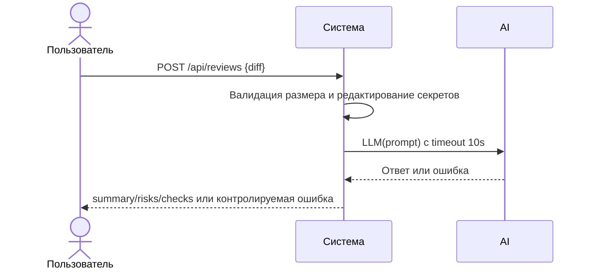

# Use cases и user stories

## Первый рабочий сценарий

**Когда** инженер отправляет diff PR в сервис, **система** валидирует размер, редактирует секреты, вызывает LLM с таймаутом и возвращает структурированный результат, **а пользователь получает** summary, до 3 рисков и список проверок.

Не входит в этот сценарий:

- approve/merge PR; изменение кода; интеграция в репозиторий заказчика; аутентификация и квоты — вне рамок первого сценария.

## Use case

| Поле | Значение |
|---|---|
| Актор | Инженер‑ревьюер |
| Триггер | Запрос POST /api/reviews с корректным diff |
| Предусловия | Сервис доступен; diff <= 20 000 символов |
| Основной результат | JSON: summary, risks (до 3), checks; решение принимает человек‑ревьюер |
| Ошибка или отказ | 413 при diff > 20 000; контролируемая ошибка при timeout/LLM‑ошибке |



## User stories и acceptance criteria

- Как инженер‑ревьюер, я хочу получать структурированный результат (summary, до 3 risks, checks) на основе diff, чтобы быстро понять основные проблемы и что проверить.
- Как тимлид, я хочу, чтобы сервис отклонял слишком большие диффы кодом 413, чтобы не тратить ресурсы и соблюдать правила API-1.
- Как QA, я хочу контролируемую ошибку при таймауте LLM, чтобы тесты были стабильными и воспроизводимыми.

```gherkin
Feature: Review diff and return structured findings

  Scenario: Позитивный
    Given корректный diff длиной <= 20 000 символов
    When пользователь отправляет POST /api/reviews с этим diff
    Then система возвращает JSON со структурой summary, risks (до 3), checks
    And каждое поле заполнено согласно OUT-1

  Scenario: Негативный или граничный
    Given diff длиной > 20 000 символов
    When пользователь отправляет POST /api/reviews
    Then система возвращает 413 Payload Too Large
```

## Как использовали AI

- Для чего: описать первый рабочий сценарий и критерии приёма.
- Тип промпта: Master Prompt v1 и текущий запуск P1-02.
- Строка в [`prompts.md`](prompts.md): P1-02.
- Что проверили и исправили сами: Требуется проверка студентом.
