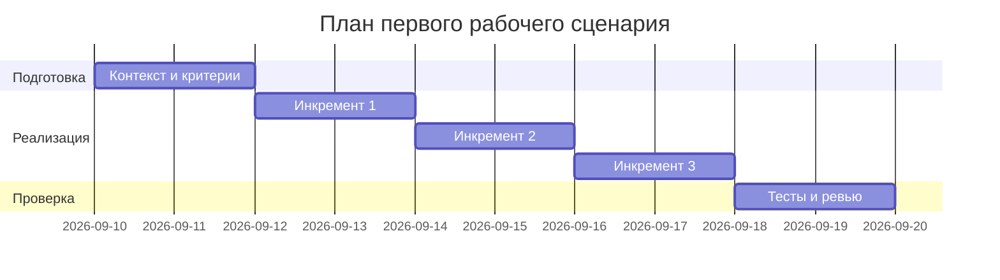

# План поставки

Файл ведёт OpenCode. Обсудите с агентом содержание и проверьте предложенный diff. Все дополнения и исправления поручайте агенту в чате.

## Инкременты и ответственность

| Инкремент | Наблюдаемый результат | Что делает человек | Что делает AI или субагент | Проверка | Зависимости |
|---|---|---|---|---|---|
| 1 | Определён контракт OUT-1 и базовые правила в Context Pack | Уточняет требования, пишет тестовые кейсы | Генерирует черновик P1-02 по TRAINING_PR.diff | Ревью структуры ответа и тестов | CASE.md, TRAINING_PR.diff |
| 2 | Валидатор размера diff и маскирование секретов | Реализует/настраивает проверки, добавляет тесты | Помогает с тестовыми профилями и негативными кейсами | Интеграционные тесты API-1, SEC-1 | Инкремент 1 |
| 3 | Таймаут LLM и контролируемые ошибки; e2e по OUT-1 | Настраивает таймауты, обрабатывает ошибки | Предлагает формулировки ошибок и чек-лист проверок | E2E сценарии и лог длительности | Инкремент 2 |

## Диаграмма Ганта

Даты и длительности — предлагаемый учебный план, требующий согласования.

## Как использовали AI

- Для чего: разбиение работ на инкременты и проверки.
- Тип промпта: Master Prompt v1 и текущий запуск P1-02.
- Строка в [`prompts.md`](prompts.md): P1-02.
- Что проверил студент и какие исправления поручил агенту: Требуется проверка студентом.
