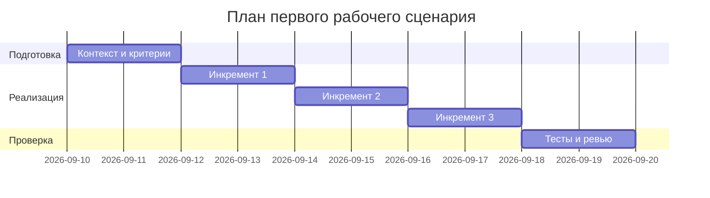

# План поставки

## Инкременты и ответственность

| Инкремент | Наблюдаемый результат | Что делает человек | Что делает AI или субагент | Проверка | Зависимости |
|---|---|---|---|---|---|
| 1. Контракт и входная безопасность (OUT-1, API-1, SEC-1, SCOPE-1) | POST /api/reviews возвращает JSON строго по OUT-1: `summary`, `risks` (≤3 элемента с `file`, `line`, `evidence`, `risk`), `checks`. Диффы > 20 000 символов получают 413 (API-1). Перед вызовом внешнего LLM из diff удалены токены, пароли и приватные ключи (SEC-1). Сервис только советует и не выполняет внешних действий (SCOPE-1). | Формирует и отправляет diff. Интерпретирует `summary/risks/checks`, при необходимости вручную запускает предложенные проверки. Решение по PR принимает сам. | Адаптер подготавливает prompt из отредактированного diff и вызывает внешнее LLM; модель возвращает текст для нормализации в OUT-1. | - Интеграционный тест API-1: diff > 20 000 символов → HTTP 413. - SEC-1: тестовые токены, пароли и приватные ключи в разных форматах (простые строки, префиксы, PEM‑блоки) не присутствуют в payload, отправляемом внешнему LLM; покрытие сценариев с похожими, но не секретными строками и случаями пропуска. - OUT-1: валидация JSON‑схемы (`summary`, `risks` ≤3, `checks`). - SCOPE-1: отсутствие побочных действий (approve/merge/изменения кода). | CASE.md (API-1, SEC-1, OUT-1, SCOPE-1). Внешний LLM.
| 2. Надёжность и наблюдаемость (REL-1, OBS-1, OUT-1 совместимость) | Вызов внешнего LLM осуществляется через адаптер с таймаутом 10 секунд (REL-1). Ошибки/таймауты конвертируются бэкендом в контролируемый ответ, совместимый с OUT-1, без раскрытия содержимого diff. В логах только `request_id`, длительность и статус (OBS-1). | Инициирует запросы, включая сценарии задержек. Проверяет предсказуемость ответа и отсутствие сырого содержимого в логах. | Бэкенд/LLM‑адаптер применяет таймаут и нормализацию ошибок; модель ничего не знает о таймаутах и ошибках, обрабатывается инфраструктурой. | - REL-1: симулированная задержка >10 секунд → контролируемый OUT-1‑совместимый ответ без навязывания кода ошибки. - OBS-1: в логах присутствуют только `request_id`, длительность и статус; отсутствуют diff и содержимое ответа модели. - OUT-1: повторная валидация структуры при ошибках. | Инкремент 1. CASE.md (REL-1, OBS-1, OUT-1).
| 3. Качество вывода и DoD (QA-1, OUT-1) | Definition of Done: каждый риск подтверждён строкой diff или правилом репозитория (QA-1); рисков не больше трёх; каждый пункт `checks` содержит конкретное действие и ожидаемый результат. | Отправляет реальные диффы. Для каждого риска переходит к `file:line`, сверяет `evidence` и запускает проверки с ожиданиями. Принимает решение по PR. | Извлекает только подтверждённые риски с привязкой к файлу/строке или правилу, дедуплицирует до 3, формирует `checks` с явным действием и ожидаемым результатом. | - QA-1 e2e: для каждого риска `file:line` существует в diff; `evidence` подтверждает риск правилом или цитатой; суммарно ≤3 риска. - Проверка `checks`: каждый пункт имеет действие и ожидаемый результат. - Повторная проверка SCOPE-1 (отсутствие побочных действий). | Инкремент 2. CASE.md (QA-1, OUT-1, SCOPE-1).

## Диаграмма Ганта

Даты и длительности — предлагаемый учебный план, требующий согласования.

## Как использовали AI

- Для чего: уточнение плана поставки под CASE.md с применением техники R.C.T.F. и формализацией DoD.
- Тип промпта: R.C.T.F. (см. practices/practice_02/rctf/experiment.md).
- Источники: файлы Practice 1 (project_management.md, problem.md, analysis.md, adr.md, CASE.md) как входной контекст.
- Что проверили и исправили сами: перераспределили ответственность таймаута/ошибок на бэкенд/LLM‑адаптер; усилили SEC-1 проверками токенов/паролей/ключей и проверкой отсутствия секретов в outbound payload; заменили субъективную «стабильную пользу» на проверяемый DoD.
